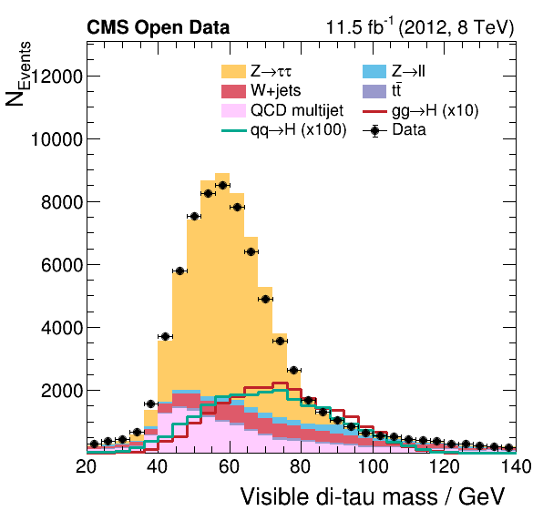

## Background estimation methods

Estimating the event yields from different background processes, and the shape of these backgrounds as a function different variables, is a central task for any analysis. By **data-driven background estimate**, we mean an estimate that is essentially based on observed real collision events (data), although often these estimates also use some simulation-based information. 

Data-driven estimates are useful to validate the predictions from simulations. Moreover, in some cases we know that our simulations cannot provide a reliable background estimate, and in these cases a data-driven background estimate is a must. Often this is the case with **QCD multijet events**. This is the background that we will estimate from data during this lesson.

In general, it is always desirable to rely on the observed events as much as possible, to minimize the risk that the results are incorrect due to some incorrect model or assumption used in the simulations. Over the decades countless background estimations have been developed, but here we will focus on one common method.

## ABCD method

A common method to obtain a data-driven background estimate is the **ABCD method**. The idea of this method is illustrated in the diagram above. 

To estimate a background process in our **signal region D**, a separate **control region C** is defined, and the background process is estimated in this region which is free of signal.

However, usually there can be some differences in the selection efficiency for the background process between regions C and D. To account for these differences, the estimate obtained in region **C** is corrected by so-called **transfer factors**. We will soon see how this all means in practice.

## QCD estimation in Higgs to tau tau example

In this lesson, we will use the open data Higgs to tau tau analysis example](https://github.com/cms-opendata-analyses/HiggsTauTauNanoAODOutreachAnalysis), where the QCD multijet background is estimated with the ABCD method. 

As shown in the diagram above, in this example the **control region C is defined by selecting events with a same-sign tau pair** (one hadronic tau and one muon from a tau decay), whereas the **in the signal region D opposite-sign tau pair is required**. The transfer factors are obtained from regions A and B, defined by inverting the isolation criterion used to select the muon. 

Next we will see how to do all of this in practice. Here is one of the final output of the Higgs to tau tau analysis, (it is the di-tau mass, reconstructed from a hadronic tau candidate and a muon candidate) showing the different background processes including the QCD background estimate that we are produce during this lesson. This plot corresponds to tour signal region **D**.



