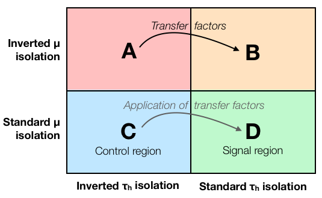

## Transfer factors

Now that we know how to obtain our background shape from control region C, the next step is to figure out its proper normalization. 

In practice it is impossible to find a control region where the selection efficiencies for each background process would be identical to the signal region. Even if the overall efficiency would be the same, probably the behaviour is not identical as a function of all different variables considered in the analysis. Therefore we usually need to **correct for the different selcetion efficiencies between regions C and D**.

This correction is done by deriving **additional event weights called transfer factors**. In the simplest case, if we think that the background shape we get from region C is correct, we can just correct its normalization by scaling this background component by some factor -- so our transfer factor is a single number, and we can weight all events in our background estimate by this single weight. However, usually also the transfer factor depends on one or several variables, so we need to apply different weights to different events.

The transfer factors are derived using two additional control regions, A and B (see the figure above). The idea is that the difference between A and B is defined by the same cut(s) as the difference between C and D, so **if we parametrize the change of our background from A to B with transfer factors, these same factors should correctly describe the difference between C and D**. 

In case of a single transfer factor, we define it as a fraction of event yields: **TF = N(B) / N(A)**. Then we can calculate the background yield in the signal region as **N(D) = TF x N(C) = (N(B)/N(A)) x N(C)**. Another way to state is is that we assume that **N(A)/N(B) = N(C)/N(D)**, and then the formula follows immediately.
If we want to catch the dependence of transfer factors on different variables, we can do this with histograms so that these same formulas hold for each single histogram bin.

## Application of a transfer factor in the Higgs to tau tau analysis example

In the Higgs to tau tau example, the transfer factor is applied in the [plot.py script](https://github.com/cms-opendata-analyses/HiggsTauTauNanoAODOutreachAnalysis/blob/master/plot.py#L155) right after the lines we were already looking at:
~~~
    # Data-driven QCD estimation
    QCD = getHistogram(tfile, "dataRunB", variable, "_cr")
    QCDRunC = getHistogram(tfile, "dataRunC", variable, "_cr")
    QCD.Add(QCDRunC)
    for name in ["W1J", "W2J", "W3J", "TT", "ZLL", "ZTT"]:
        ss = getHistogram(tfile, name, variable, "_cr")
        QCD.Add(ss, -1.0)
    for i in range(1, QCD.GetNbinsX() + 1):
        if QCD.GetBinContent(i) < 0.0:
            QCD.SetBinContent(i, 0.0)
    QCDScaleFactor = 0.80
    QCD.Scale(QCDScaleFactor)
~~~
{: .python}

So here our transfer factor is a single number, 0.8, which is applied as an event weight to all events in our QCD histogram, effectively scaling the QCD background estimate down by 20 percent. 

> ## Challenge
> Try changing the value of QCDScaleFactor e.g. to 0.5 or 1.0, re-run "python plot.py" and inspect how resulting plots change.
{: .challenge}

## Derivation of a transfer factor in the Higgs to tau tau analysis example

At this point you might be wondering: where did this transfer factor come from? Let us find out by trying to derive it ourselves!

As discussed above, the code histograms.py produces the histograms for regions C and D. 
To derive transfer factors, we want to produce exactly the same histograms, but for regions A and B. 

Let us define regions A and B so that they are identical to C and D, except that **we invert the muon isolation criterion**. Instead of requiring a tightly isolated muon (iso_1<0.1), let us use events with more loosely isolated muons and require iso_1>0.1. 

> ## Challenge
> Make a copy f the histograms.py file:
> ~~~
> cp hisrograms.py histograms_antiiso.py
> ~~~
> {: .language-bash}
> Then modify the file by changing the muon isolation cut from iso_1<0.1 to iso_1>0.1. 
> Also change the output file name from histograms.root to histograms_antiiso.root.
> Then run the modified script to produce histograms for regions A and B:
> > ~~~
> python histograms_antiiso.py
> ~~~
> {: .language-bash}
{: .challenge}

Now that we have the histograms for regions A and B, we can use them to derive the transfer factors. 
For doing this, we use a separate script that is available [here](https://github.com/cms-opendata-workshop/workshop-lesson-abcd-method/blob/gh-pages/code/transfer_factors.py). 

> ## Challenge
> Download the script transfer_factors.py to the same directory where you have your new histogram file histograms_antiiso.root, inspect what it does, and then run it:
> ~~~
> wget https://raw.githubusercontent.com/cms-opendata-workshop/workshop-lesson-abcd-method/gh-pages/code/transfer_factors.py
> python transfer_factors.py
> ~~~
> {: .language-bash}
> What is the transfer factor given by the script?
{: .challenge}

(You should get a transfer factor of 1.09, which is actually quite different from 0.8 used in the original example. Our aim here is just to demonstrate the idea of transfer factor estimation.)


