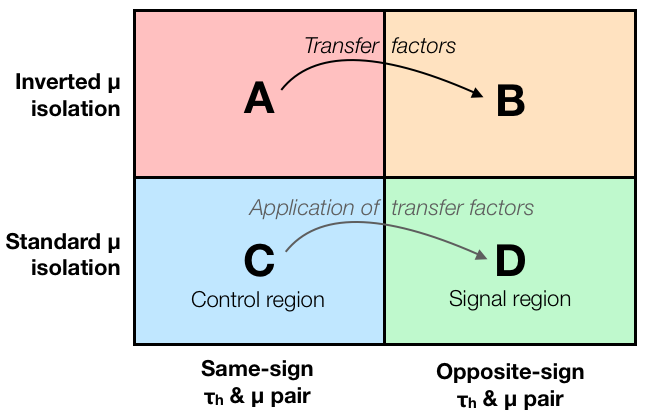

## Summary of the ABCD method

By now, everything shown in this schematic should be clear to us, and we know how to do this in practice in Higgs to tau tau analysis.

## Validation of the background estimate

But how can we convince ourselves that our background estimation method works and gives us a good estimate? One way to get some confidence is to define additional signal-free *validation region*, again by changing some cut(s) in the analysis, then split it into the four regions A, B, C, and D in the same way as in the original analysis, and check that the background estimate agrees with data. Then we know that the method works at least in the validation region.

Another common approach is to use **pdeudo-data**, i.e. replace the real data with a sum of simulated samples, including the background we want to estimate with ABCD such as QCD. Then we can check that the background estimation method reproduces the correct results, because this time we know the "true" background composition of our pseudo-data. This simulated pseudo-data can also have some simulated signal included in the mix, so we can check that the signal doesn't accidentally get absorbed into our background estimate.

## Systematic uncertainties

Like all analysis steps, the ABCD metod comes with some systematic uncertainties. Possible sources include **(a)** the systematic uncertainties of the simulated samples that are subtracted from data in regions A, B and C, **(b)** the statistical uncertainty of the background shape due to limited statistics in region C, **(c)** the statisical uncertainty of transfer factors due to limited statistics in regions A and B. In a realistic analysis, these (and possibly others) should be taken into account.

## More advanced versions of the ABCD method

There are plenty of more advanced methods based on the simple ABCD idea. These can include analytic fits of distributions (to trade statistical uncertainties with possibly smaller fit uncertainties), sampling of the background shape and transfer factors in several dimensions (i.e. as a function of several different variables), simultaneous fits of all regions as well as possibly other control regions, etc. It has been shown that [using machine learning tools to optimize the selections](https://arxiv.org/abs/2007.14400) for different regions can lead to further improvement in analysis sensitivity. So we have really just scratched the surface here, but now you have the basic knowledge to dive deeper when you feel like doing it! 


